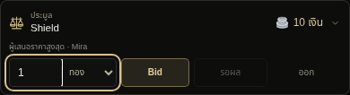
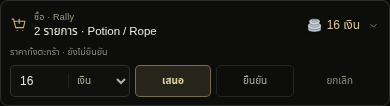
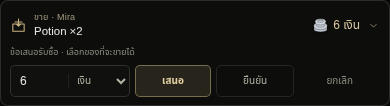
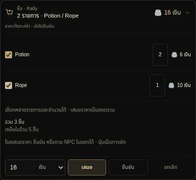
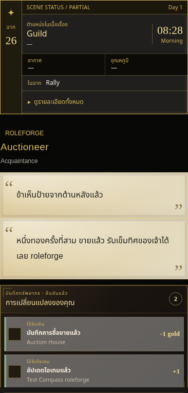

# v0.51.8 — แบบ A และโรลต่อในข้อความล่าสุด

## ดีไซน์ที่เลือก

ใช้ Summary compact A ตามที่ผู้ใช้เลือกกับประมูล ซื้อ และขาย: พื้นหลังดำ `#0d0e0c`, เส้นกรอบบาง, สีปุ่มหลักทองหม่น `#b8a57226` และข้อความ `#e1cea0` ปุ่มสูง 32 px ช่องจำนวนและหน่วยเงินอยู่ในกรอบเดียว ตัวควบคุมไม่ขยายกว้างตามจอ desktop ทั้งหมด

ปุ่มบนแถบใช้ชื่อสั้น Bid / รอผล / ออก และ เสนอ / ยืนยัน / ยกเลิก พร้อม title และ aria-label ชื่อการกระทำเต็ม รายละเอียดสินค้า ตะกร้าหลายรายการ จำนวน งบผู้ประมูล และเงื่อนไขค่าเข้า/เงินกันไว้ยังขยายดูได้ ปุ่มเข้าร่วมโดยยังไม่บิดอยู่ในส่วนรายละเอียดประมูล ไม่ดันช่องหน่วยเงินลงไปอีกแถว การเปลี่ยนรายการ/จำนวน/หน่วยเงินและขยายข้อมูลยังไม่เรียก API

รูปมาจาก UI extension จริงผ่าน production loader บน host ทดสอบ ใช้ชื่อไอเทม เงิน และคำตอบ NPC จำลอง ไม่ใช่ chatbar ของบัญชีผู้ใช้

## สาเหตุที่รับของแล้วเหมือนไม่มีโรลต่อ

พบเส้นทางบั๊กสองจุดในโค้ดที่อธิบายอาการได้:

1. หลังคำตอบโรลที่ตรวจไม่ผ่าน engine ไม่เปลี่ยนเงินหรือราคา และยังเก็บ source ของการเจรจาไว้ที่ข้อความ NPC ก่อนหน้า เดิมปุ่มใช้ source นั้นเป็นเป้าหมายต่อข้อความด้วย ทำให้ Bid ที่ถูกต้องรอบถัดไปเพิ่มโรลในข้อความเปิดประมูลเก่า ขณะที่ผู้ใช้กำลังอ่านคำตอบล่าสุด
2. `updateMessageBlock` ของ SillyTavern เลือก `message.extra.display_text` ก่อน `message.mes` ถ้ามี เดิม commerce ต่อเฉพาะ mes และ swipe จึงมีเส้นทางที่ข้อมูลเงินจริงถูกบันทึก แต่ข้อความบนจอยังเป็น display override เดิม

การชนะผ่านปุ่มต้องมีทั้ง narrative และ decision ที่ผ่าน validator ก่อนรับของ ไม่มีเส้นทางชนะของโดยไม่รับ narrative ใน API response อาการดังกล่าวจึงเกิดได้ในขั้นเลือกกล่องข้อความ/แสดงผล ไม่ได้แปลว่า AI ไม่มีคำตอบ

## การแก้

- เลือกข้อความ assistant ล่าสุดเป็นเป้าหมายต่อโรลเมื่อกดปุ่ม โดยยังตรวจและชำระ session เดิมตามราคา revision งบและสิทธิ์เดิม การเปลี่ยนแชต ข้อความ หรือ state ระหว่างรอยังทำให้คำตอบนั้นถูกทิ้ง
- เก็บ normal role-play source เดิมไว้จนกว่าจะผ่านการประเมิน เพื่อไม่ข้าม validator ของข้อความหลัก การเลือกเป้าหมายใหม่เกิดเฉพาะเมื่อปุ่มเริ่มทำงาน
- ต่อ narrative ใน `mes`, active swipe และ display override ที่เป็น string โดยคงข้อความ/รูปแบบเดิม ไม่สร้างข้อความ user หรือข้อความ assistant แยก
- หลังโฮสต์ render ให้ refresh รูปแบบ RoleForge ด้วย หาก native rendering ใช้ไม่ได้ ใช้ formatter หรือ text fallback แสดงข้อมูลที่บันทึกแล้ว
- บันทึกข้อความและผลเงิน/ของร่วมกัน หากบันทึกล้มเหลวคืน metadata, mes, swipe และ display override รอบนั้น ไม่มีการเรียก AI ซ้ำอัตโนมัติ

ภาพนี้จำลองโรลที่ถูกปฏิเสธก่อนหน้า แล้วกด Bid 1 ทองที่ถูกต้อง คำตอบส่งมอบของต่อท้าย NPC ล่าสุดในกล่องเดิม กล่องเปิดประมูลและข้อความผู้เล่นเดิมคงอยู่ เงินลด 1 ทองและได้ของหนึ่งชิ้นเพียงครั้งเดียว

## ตรวจสอบ

ผ่าน 671 unit/host tests และ syntax checks รวมการต่อข้อความหลังโรลที่ล้มเหลว การบันทึก display override ร่วมกับ prose/swipe และการคืนทั้งหมดเมื่อ save ไม่สำเร็จ

Browser ผ่าน production loader ที่ 320/390/1280 px ทดสอบ Bid 1 ทองแล้วชนะหลัง role-play evidence ที่ไม่ผ่าน ทั้งรูปแบบ RoleForge, native และ preserved ตรวจว่าต่อใน bubble ล่าสุด กล่องเก่าไม่ถูกแก้ user ไม่ถูกเขียนใหม่ จำนวนข้อความไม่เพิ่ม หนึ่งปุ่มใช้หนึ่ง task API ของเข้าหนึ่งครั้ง และหน้าต่างปิดเมื่อจบ

จำลอง host-wide styles ที่ทำให้ปุ่ม/ช่องกรอกสูง 44px และ select กว้างเต็มพื้นที่ แล้วตรวจตัวควบคุม A ว่ายังสูง 32px อยู่แถวเดียวและไม่ขยายเกินขนาดที่ออกแบบ รองรับมือถือและ desktop ตรวจซื้อ/ขายหลายรายการ การเลือกชุดเหรียญ optional switches null regressions และการอยู่ร่วมกับ Summary ใน fixed/native flow ด้วย

คำตอบ provider ในการทดสอบเป็นข้อมูลจำลอง ยังไม่ได้เรียก API ของผู้ใช้โดยตรง อัปเดต extension และ reload หน้าเพื่อโหลด v0.51.8 โดยไม่ต้อง reset state
