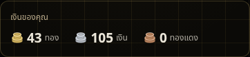
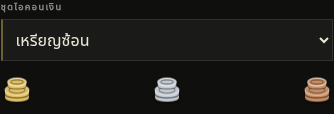
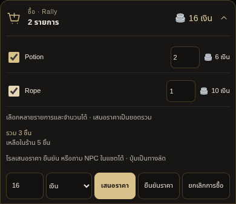
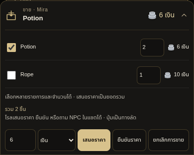
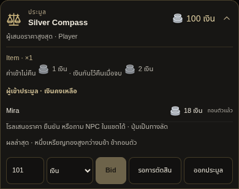

# v0.51.6 — ค่าเงิน ตะกร้าซื้อขาย และชุดเหรียญ

ปัญหา “1 เหรียญทอง” เกิดจาก validator เดิมปฏิเสธเงินคนละหน่วยกับรายการ และยังไม่มีอัตราแลก ดังนั้น AI อาจเล่าว่ารับข้อเสนอแล้ว แต่ engine ยังปฏิเสธ ไม่ได้เป็นเพราะยอดเงินผู้เล่นไม่มีทอง

ใช้อัตราที่ผู้ใช้กำหนด: **1 ทอง = 100 เงิน และ 1 เงิน = 100 ทองแดง** ปุ่มและการโรลเทียบมูลค่าเดียวกัน โดยแปลงข้อเสนอเป็นหน่วยของรายการก่อนตรวจขั้นต่ำและงบคู่แข่ง เช่น 1 ทองในประมูลราคา 10 เงิน คือข้อเสนอ 100 เงิน เงินที่กันไว้และยอดใช้ได้คิดจากมูลค่ารวมเช่นกัน การจ่ายด้วยเหรียญใหญ่แตกทอนได้อย่างตรงมูลค่า ไม่มีค่าธรรมเนียมแลกเงิน และใช้เหรียญหน่วยเดิมก่อนถ้ามีเพียงพอ

## เหรียญและ Inventory

ยอดทอง เงิน และทองแดงอยู่ด้านบนหน้า Inventory แล้ว ไม่ต้องเลื่อนไป Rank ค่าเริ่มต้นใช้ภาพเหรียญซ้อนที่มีสีโลหะแตกต่างกัน เลือกชุดได้ใน **ศูนย์ควบคุม → Interface → ชุดไอคอนเงิน** หรือหน้าตั้งค่า extension:

- เหรียญซ้อน: กองเหรียญมีชั้นและแสงบนขอบ
- เหรียญตราดาว: เหรียญเดี่ยวมีตรากลาง
- เส้นรอบนอก: แบบเส้นเรียบ

การเลือกชุดบันทึกใน settings และใช้ร่วมกันใน Inventory/หน้าต่างประมูล/ซื้อขาย ไม่เรียก API หรือเปลี่ยนเงินและของ ภาพเป็น vector ที่มีข้อความกำกับหน่วยเงิน ไม่ขึ้นกับฟอนต์อิโมจิ

## ซื้อและขายหลายรายการ

เมื่อขยายหน้าต่าง ซื้อจะแสดงรายการสินค้า checkbox จำนวนและราคารวมแต่ละแถว เลือกหลายรายการ ต่อรองยอดรวม และยืนยันครั้งเดียวได้

ฝั่งขาย NPC สามารถเสนอรับซื้อหลายรายการจาก inventory ที่ผู้เล่นมีจริงในคำตอบปกติเดียวกัน โดยแสดงราคาของแต่ละรายการ ผู้เล่นเอารายการที่ไม่ขายออก ลดจำนวน หรือโรล เช่น “ไม่ขาย Rope” ก่อนต่อรองได้ การเปลี่ยนรายการยกเลิกราคาตกลงเก่าและคำนวณยอดจากรายการใหม่ เพื่อไม่ใช้ยอดของตะกร้าเก่าไปจ่ายตะกร้าใหม่

รายการเปิดใช้ `marketplace.kind:"npcPurchase"` กับ `items:[{itemId,itemName,quantity,askPrice}]` แทน `item/askPrice` ของรูปแบบเดิม โดย askPrice เป็นยอดรวมของจำนวนในแถวนั้น ทุก item ต้องมีเจ้าของ จำนวนเพียงพอ ชื่อและ ID ตรง inventory และอยู่ในหลักฐานคำตอบจริง ทั้งสองรูปแบบยังรองรับการเจรจาชิ้นเดียวที่บันทึกไว้แล้ว

ระหว่างการโรลใช้ `commerce.items:[{itemId,quantity}]` เลือก line IDs เดิม พร้อม sessionId/revision และ decision การเอารายการออกต้องมีเจตนาจากข้อความผู้เล่น ไม่ใช่ AI แอบเลือกให้ การถามหรือเลือกรายการยังไม่โอนของ/เงิน ปุ่มเกมใช้ API task เดิม ส่วนการโรลใช้คำตอบ main API เดียว

หนึ่งการยืนยันโอนทุกแถวและบันทึกการจ่ายครั้งเดียว งบ NPC ตรวจจากยอดรวม รายการซ้ำ ของไม่รู้จัก stock/ownership ไม่พอ เงินไม่พอ หรือการโอนแถวใดล้มเหลว จะไม่บันทึกเงิน/ของ/receipt ของตะกร้านั้นเลย เอาทุกชิ้นออกยังยกเลิกหน้าต่างได้

## ค่าเข้าและมัดจำ

งานประมูลทั่วไปอาจเข้าฟรีได้ งานทางการหรือของมีมูลค่าสูงให้ AI ประกาศเงื่อนไขที่เหมาะกับสถานที่ในคำตอบเปิดรายการ เช่น ราคาเปิดตัวแทน 100 เงิน ค่าเข้า 1–2 เงิน และมัดจำประมาณ 5–10 เงิน:

| เงื่อนไข | กลไก |
| --- | --- |
| ค่าเข้า | จ่ายครั้งเดียวเมื่อเข้าร่วม ไม่คืน รวมถึงการบิดครั้งแรกที่เข้าร่วมโดยปริยาย |
| มัดจำ | กันเงินในกระเป๋าระหว่างเข้าร่วม ใช้ซื้ออย่างอื่นไม่ได้ และปล่อยคืนเมื่อจบหรือออกตามกติกา |
| ราคาชนะ | จ่ายราคาที่ชนะต่างหาก; มัดจำไม่ถูกคิดเป็นค่าของซ้ำ |
| งานเข้าฟรี | แสดง “เข้าร่วมฟรี · ไม่มีมัดจำ” |

ต้องเห็นเงื่อนไขก่อนบิด ไม่เติมค่าใช้จ่ายให้การประมูลเดิมที่เปิดไปแล้ว ไม่ตั้งค่าจากเงินทั้งหมดของผู้เล่น ไม่มีค่าปรับริบมัดจำที่สร้างเพิ่ม และการออกขณะเป็นผู้เสนอสูงสุดยังต้องเคารพภาระชนะ/การถูกบิดแซงตามกติกาเดิม

รูปประกอบมาจาก UI extension จริงบน host ทดสอบ ใช้ข้อมูลและคำตอบ NPC จำลอง ภาพตัดเฉพาะหน้าต่าง/ยอดเงิน ไม่ใช่ chatbar ของบัญชีผู้ใช้

## การตรวจสอบ

ทดสอบการเสนอ 1 ทองผ่านโรลและปุ่ม การเทียบเงิน/ทองแดง การจ่ายและแตกทอน ค่าเข้า once-only มัดจำกัน/ปล่อย การซื้อหลายชิ้น/จำนวน การขายหลายรายการ/เอาของออก ราคาตกลงเก่า งบ NPC รวม การยืนยันซ้ำ และ rollback กรณีแถวท้ายโอนไม่สำเร็จ

Browser ผ่าน production loader ที่ 320/390/1280 px พร้อมตรวจ popup รายการซื้อ/ขาย ยอดเงิน Inventory การเลือกชุดเหรียญผ่านตั้งค่าโดยไม่เรียก API และระบบเดิม normal/swipe/regenerate/boards/optional gates ใช้ provider replies จำลอง ยังไม่ได้เรียก provider ส่วนตัวของผู้ใช้

อัปเดตเป็น v0.51.6 แล้ว reload หน้าครั้งหนึ่ง ข้อมูลเดิมคงอยู่ รายการขายชิ้นเดียวที่เปิดอยู่ยังใช้ได้ หากต้องการข้อเสนอหลายรายการใหม่ให้โรลขอให้ NPC ประเมินของที่ต้องการขาย
