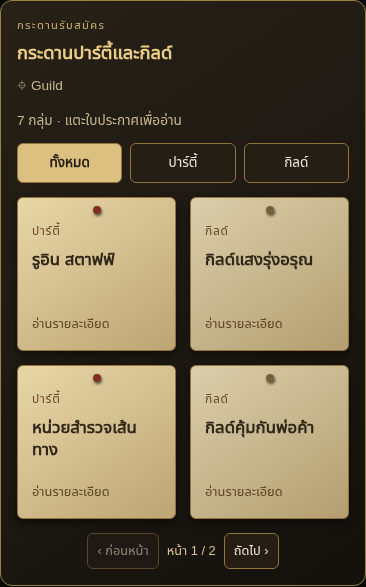

# v0.51.10 — กระดานปาร์ตี้/กิลด์แบบใบประกาศ

หน้ารวมใช้ใบประกาศเล็กสองคอลัมน์แบบกระดานภารกิจ รวมถึงจอมือถือ 320 พิกเซล แต่ละใบแสดงประเภทปาร์ตี้/กิลด์ ชื่อกลุ่ม และข้อความอ่านรายละเอียด แตะได้ทั้งใบ หรือใช้คีย์บอร์ดเปิดอ่าน

รายละเอียดสมาชิก หัวหน้า ที่ว่าง แรงก์ คำบรรยาย เงื่อนไข แท็ก และส่วนแบ่งอยู่ในหน้ารายละเอียดของใบที่เลือก ชื่อยาวแสดงได้สูงสุดสามบรรทัดในหน้ารวม โดยยังอ่านชื่อเต็มได้ในรายละเอียด

รายการใหม่เริ่มที่ 4 ใบต่อหน้าเพื่อจัดเป็น 2×2 กระดานเดิมที่บันทึกจำนวนต่อหน้าไว้ชัดเจนยังใช้ค่านั้น แต่แสดงเป็นสองคอลัมน์เช่นกัน ตัวกรองทั้งหมด/ปาร์ตี้/กิลด์และ Pagination ยังใช้งานได้ การเปิดรายละเอียด เปลี่ยนหน้า และกรองรายการไม่เรียก AI เพิ่ม

ตรวจ 32 tests ที่เกี่ยวข้อง, syntax checks และ Main Chat จาก production loader ที่ 320/390/1280 พิกเซล ตรวจการจัดสองคอลัมน์ การเปิดด้วยคีย์บอร์ด การแสดงรายละเอียด การกรอง การเปลี่ยนหน้า และจำนวน API calls ภาพใช้ UI ของ extension จริงบนโฮสต์ทดสอบกับคำตอบ provider จำลอง

อัปเดตเป็น v0.51.10 แล้วรีโหลด กระดานที่บันทึกไว้จะแสดงหน้าตาใหม่ได้โดยไม่ต้องสร้างคำตอบ AI ใหม่
