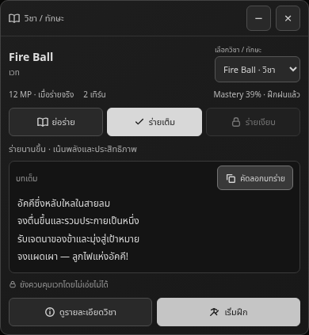
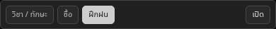
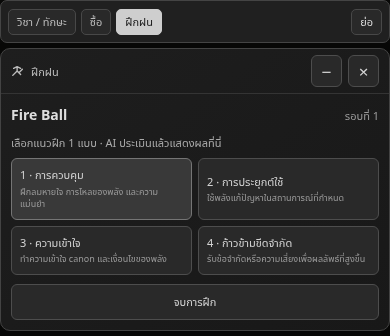

# วิชา ทักษะ บทร่าย และการฝึก — v0.52.0

เปิดหน้าต่างจาก **ตั้งค่าส่วนเสริม → RoleForge → Incantation → แสดงหน้าต่างบทร่าย** หรือกด **ดูวิชา / บทร่าย** จากรายการวิชา/ทักษะ ตั้งค่า NPC ให้ร่ายและภาษาบทร่ายแยกกันได้ มีตัวเลือกตามภาษาโรล ไทย อังกฤษ ญี่ปุ่น จีน ละติน และระบุภาษาเอง

การปิดสวิตช์หน้าต่างซ่อน UI เท่านั้น กฎบทร่ายผู้เล่นยังส่งไปพร้อมการเจนข้อความปกติ สวิตช์ NPC ควบคุมข้อกำหนดบทร่าย NPC แยกต่างหาก ค่าเริ่มต้นของหน้าต่างและสวิตช์ NPC เป็นปิด ผู้ใช้เป็นผู้เลือกเปิด

## ข้อมูลและการร่าย

AI ส่งรายละเอียดเมื่อสอน/ยืนยันการเรียนรู้วิชาหรือทักษะในคำตอบปกติเดียวกัน ไม่เรียกเพิ่มเมื่อเลือกอ่านข้อมูล ข้อมูลอยู่ในรายการ `skills` และ `proficiencies.techniques` เดิม:

- `skills.mastery` และ `proficiencies.techniques.proficiency` เก็บ Mastery 0–100%
- `ability.kind` จำแนก magic / physical / passive / other
- `ability.effect`, `element`, `range`, `target`, `conditions`, `strengths`, `weaknesses`, `advantages`, `disadvantages`
- `ability.costs`: resource / amount / note และ `costKnown` เพื่อแยกข้อมูลที่ไม่ทราบจากการใช้ฟรี
- `ability.cooldown`: value / unit / remaining / ready / condition / startedAt รองรับ seconds / minutes / hours / days / turns / none หน้าต่างแสดงระยะ Cooldown ของวิชาและระยะที่ยังเหลือเมื่ออยู่ระหว่างพัก
- `ability.incantation`: required / language / short / full / silent.available / silent.reason

บทเต็มมีหลายบรรทัดและต่างจากบทย่อ ร่ายเต็มเน้นพลังและประสิทธิภาพแลกกับเวลา ย่อร่ายเน้นความเร็วและอาจอ่อนลงเมื่อยังไม่ชำนาญ เมื่อชำนาญมาก ย่อร่ายและร่ายเงียบทรงพลังได้ ไม่มีตัวคูณตายตัวและไม่ปลดล็อกตามเปอร์เซ็นต์เพียงอย่างเดียว ต้องมีความสามารถยืนยันจากเรื่อง

วิชากายภาพและทักษะติดตัวไม่ถูกบังคับให้มีบทร่าย การเลือกหรือกด Copy ไม่ใช้เวท ไม่ส่งข้อความผู้เล่น ไม่หัก Cost และไม่เพิ่ม Mastery ผู้เล่นพิมพ์บทร่าย/การกระทำใน Main Chat เอง AI ตัดสินผลจากบริบท สมาธิ เป้าหมาย ทรัพยากร และการขัดจังหวะ การซ้อมเพิ่ม Mastery ได้ตามความพยายาม แต่ไม่สำเร็จหรือเพิ่มคะแนนอัตโนมัติจากการวางข้อความซ้ำ

Cost ของการใช้จริง การซ้อม หรือความล้มเหลวขึ้นกับกฎของแต่ละวิชา Cooldown เปลี่ยนตามเวลาภายในเรื่องหรือรอบการกระทำที่ยืนยัน ไม่เปลี่ยนจากนาฬิกาเบราว์เซอร์หรือการเปิดหน้าต่าง

รายการเก่าที่ไม่มีรายละเอียดแสดงว่าไม่ทราบ ข้อมูลจะเติมเมื่อคำตอบปกติอธิบาย/สอน/ใช้วิชานั้นตามเรื่อง ไม่สร้างค่าใช้หรือบทร่ายย้อนหลังขึ้นมาเอง และไม่มีคำขอ AI แยกเพื่อกู้ข้อมูล

## Mastery และระดับ

Mastery สะสมต่อเนื่องโดยไม่รีเซ็ต ใช้ระดับเดียวกับความชำนาญพลังเดิม: Dormant ที่ 0, Beginner ต่ำกว่า 15, Practiced ต่ำกว่า 40, Adept ต่ำกว่า 60, Expert ต่ำกว่า 75, Master ต่ำกว่า 87, Grandmaster ต่ำกว่า 97 และ Mythic ตั้งแต่ 97 ถึง 100 ระดับนี้เป็นป้ายความชำนาญ ไม่เปลี่ยน Rank ตาม lore หรือ Rank ของตัวละคร

การฝึกจากโรลใช้ absolute upsert ของ Mastery และผ่านระบบบันทึกต่อคำตอบ/variant เดิม จึงไม่บวกอีกจากการ render หรือรับ completion ซ้ำ การ swipe ใช้สถานะฐานของคำตอบแล้วบันทึกผล variant ที่เลือก

## การฝึกเหนือ chatbar

กดฝึกจากหน้าพลัง วิชา หรือทักษะ → ปิดหน้าต่าง RoleForge → กลับ Main Chat → เปิดหน้าต่างฝึกแยกเหนือช่องพิมพ์ เลือกหนึ่งในสี่แนวเดิม: การควบคุม การประยุกต์ใช้ ความเข้าใจ และก้าวข้ามขีดจำกัด

การเริ่มรอบไม่เรียก AI การเลือกแนวฝึกเรียก quiet AI หนึ่งครั้งเหมือนระบบเดิมและแสดงผลในหน้าต่างฝึก ไม่สร้างข้อความผู้เล่นปลอมและไม่เพิ่มข้อความใน Main Chat เมื่อได้ผล เลือกฝึกต่อหรือจบได้

ย่อเก็บสถานะไว้ จบการฝึกปิด session และเก็บผลที่บันทึกแล้ว หากจบขณะกำลังประเมิน จะไม่รับผลที่กลับมาทีหลัง คำขอที่โฮสต์ยังส่งอยู่ต้องเสร็จก่อนเริ่มคำขอ AI ใหม่ ไม่อ้างว่าหยุด provider ได้ทันที การเปลี่ยนแชตตรวจ chat ID/metadata/session ก่อนรับผล เมื่อรีโหลดระหว่างประเมิน session ที่ค้างกลับไปให้เลือกแนวฝึกได้

## หน้าต่างแยกและการจัดตำแหน่ง

วิชา/ทักษะ ฝึก และประมูล/ซื้อขายยังเก็บหน้าต่างและงานแยกกัน เมื่อเปิดระบบเดียวแสดงหน้าต่างนั้นโดยตรง เมื่อมีหลายหน้าต่างค่อยแสดงแท็บและเปิดทีละอัน เปลี่ยนแท็บไม่ล้างข้อความที่กรอก ไม่เรียก AI และไม่ยกเลิกงาน รองรับการเลือกแท็บด้วยปุ่มลูกศร/Home/End

มีสามสถานะ: ปกติเป็นหน้าต่างกะทัดรัด, ขยายเป็นรายละเอียด/บทร่ายเต็ม, Minimize พับทั้งพื้นที่เหลือแถบบางเหนือช่องพิมพ์ กดเปิดหรือแท็บที่ต้องการเพื่อกลับมาทำงาน ปุ่มย่อของหน้าต่างวิชา/ฝึกและปุ่มย่อกลางใช้สถานะพับเดียวกัน ประมูล ซื้อขาย และ Summary ใช้ปุ่มย่อกลางได้ การย่อไม่ใช่การจบฝึกหรือออกประมูล

สถานะ Summary คงปุ่มหยุดสรุปและพฤติกรรมเดิม เมื่อพับยังมีตัวบอกว่ากำลังสรุป ปุ่มที่เรียก AI ปิดใช้งานเมื่อคำขออื่นกำลังทำงาน แต่เลือกอ่านรายละเอียดและคัดลอกได้ จำกัดความสูงของพื้นที่และเลื่อนภายในเพื่อไม่บังช่องพิมพ์

## ภาพจาก UI จริงและการตรวจ

ตรวจ production loader ที่ 320/390/1280 px: ข้อมูลจาก normal reply, Copy ทั้งบทเต็มโดยไม่เรียกเพิ่ม, ทักษะกายภาพไม่มีบทร่าย, ฝึกวิชาและทักษะ, กลับ Main Chat จากหน้าพลัง, จบฝึกระหว่างรอแล้วไม่รับผล, completion ซ้ำและ swipe ไม่บวกซ้ำ, partial cooldown ไม่ลบบทร่าย, แท็บเมื่อมีหลายหน้าต่างและพับเหลือแถบบางไม่ทับช่องพิมพ์, ซ่อน UI แล้วยังส่งกฎผู้เล่น และสวิตช์ NPC แยกกัน รวมถึงสถานะ Summary ร่วมกับสามหน้าต่าง การย่อ/เปิดและสลับแท็บไม่ล้างราคา ใช้คำตอบ provider จำลองเพื่อทดสอบการเชื่อมต่อจริงของ extension; ไม่ใช่การรับประกันว่า AI ทุก provider จะทำตาม instruction ทุกครั้ง
