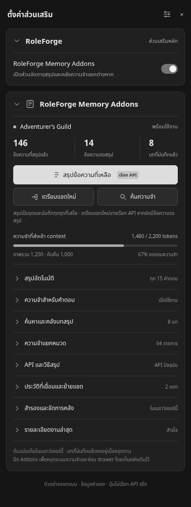
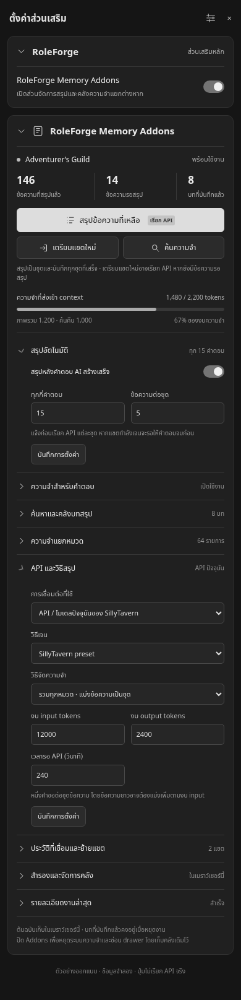
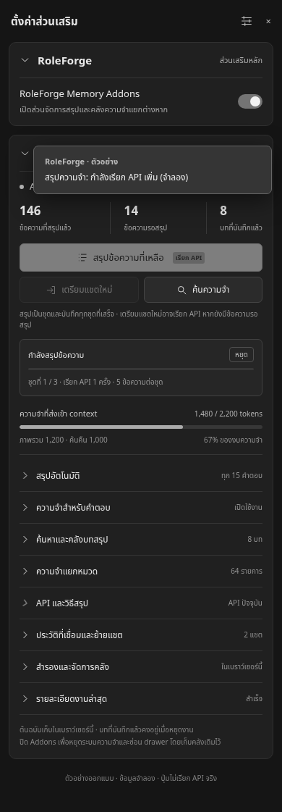

# RoleForge Memory Addons · ตัวอย่างรอเลือก

นี่เป็นต้นแบบหน้าตา ยังไม่ย้าย Summary จริงและไม่เปลี่ยนคลังหรือกลไกสรุป เปิด [ตัวอย่างโต้ตอบ](previews/memory-addons-concept.html) ได้ในเบราว์เซอร์ ปุ่มทำงานจำลอง ไม่มีการเรียก API

## การจัดหน้าที่เสนอ

1. ในตั้งค่าส่วนเสริม RoleForge มีสวิตช์ **RoleForge Memory Addons** เปิดแล้วแสดง drawer แยกในหน้าตั้งค่าส่วนเสริมเดียวกัน ใช้สวิตช์เปิดระบบ Summary เดิม ไม่ต้องติดตั้งส่วนเสริมอีกชุด ปิดแล้วหยุดระบบและซ่อน drawer โดยเก็บคลังเดิม
2. ด้านบนของ drawer แสดงแชตปัจจุบัน สถานะ ข้อความที่สรุปแล้ว/รอสรุป และบทที่บันทึกแล้ว ปุ่มหลักสรุปข้อความที่เหลือ พร้อมป้ายเรียก API ตามด้วยเตรียมแชตใหม่และค้นความจำ
3. แถบโทเคนแสดงการใช้ **งบความจำที่ส่งเข้า context** แยกงบภาพรวมและค้นคืน ตัวเลขไม่ใช่ context ทั้งหมดของโมเดลหรือยอดใช้โทเคนที่ provider เรียกเก็บ
4. หมวดพับได้: สรุปอัตโนมัติ, ความจำสำหรับคำตอบ, ค้นหาและคลังบทสรุป, ความจำแยกหมวด, API และวิธีสรุป, ประวัติที่เชื่อมและย้ายแชต, สำรองคลัง, รายละเอียดงานล่าสุด
5. ตั้งค่า API/โปรไฟล์ วิธีเจน preset/compact วิธีสรุป batch/single/categories ขนาดชุด งบ input/output และเวลารอได้จากหมวด API เก็บฟังก์ชันแก้ไขบทสรุป ดูรุ่นเก่า และตรวจข้อความต้นทางไว้ในคลัง
6. หมวดความจำในตัวอย่างรวมหมวดเดิมเป็นกลุ่มเพื่อแสดงผลเท่านั้น ไม่เปลี่ยนโครงสร้างข้อมูล และไม่มีสวิตช์หมวดใหม่ที่กลไกเดิมยังไม่รองรับ
7. งานกำลังสรุปแสดงความคืบหน้าและปุ่มหยุดใน drawer ส่วนสถานะเหนือ chatbar ยังใช้หน้าต่าง Summary เดิมและระบบ Minimize/แท็บเดิม

ใช้ดำ–เทา สีเน้นน้อย เส้นแบ่งบาง ปุ่มสั้นและชัดว่ากดได้ ขยายเฉพาะหมวดที่ต้องการ จุดหลักอิงความอ่านง่ายจากภาพ Smart Memory Optimized โดยแสดงฟังก์ชันที่ RoleForge มีอยู่จริง

หลังผู้ใช้เลือกหน้าตาจึงย้ายตัวควบคุม Summary ออกจาก RoleForge UI มา drawer นี้ ใช้ runtime/store ชุดเดิม ไม่ย้ายหรือล้างข้อมูล ไม่ทำให้การเปิด drawer เรียก AI เพิ่ม
