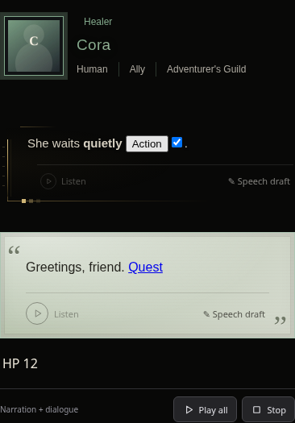
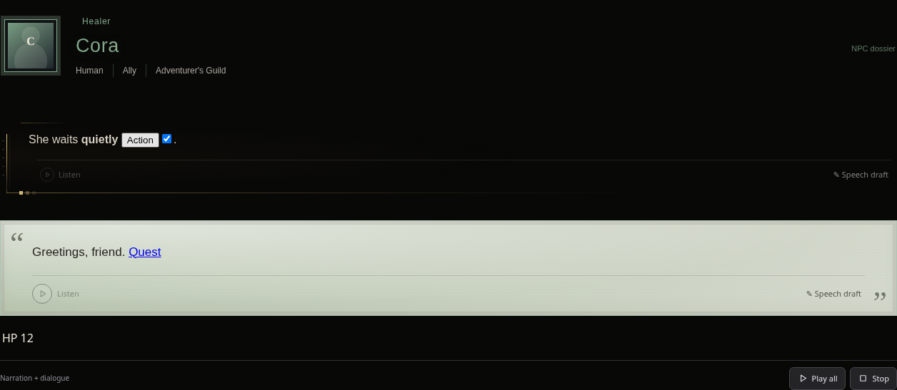
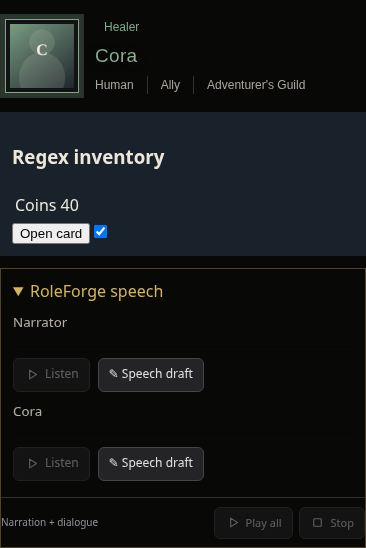
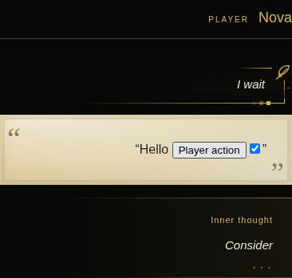

# RoleForge + Regex — 0.60.0

RoleForge แสดง UI ร่วมกับผลของ Regex โดยเก็บ HTML และองค์ประกอบเดิมที่ SillyTavern สร้างไว้ รวมปุ่ม ช่องกรอก ลิงก์ ตาราง และสถานะที่ผู้เล่นกรอก แทนการสร้างข้อความใหม่ทับการ์ดของ Regex

## ตั้งค่า

อัปเดตจาก main แล้วรีโหลด เปิด **Extensions → RoleForge → Chat appearance & NPCs** เลือก **RoleForge + Regex · แสดงร่วมกัน (Shared)** และเปิด **Header / Dialogue / Narrative** หากต้องการ UI ของ NPC

Shared เป็นค่าเริ่มต้นสำหรับการตั้งค่าใหม่ ผู้ใช้ที่เคยเปิดรักษา Native ไว้จะยังใช้ Native เพื่อเก็บความตั้งใจเดิม เลือก Shared เพื่อใช้ทั้งสองรูปแบบได้โดยไม่ล้างข้อมูลเกม

| โหมด | ผลที่ได้ |
| --- | --- |
| Shared | เก็บ Regex แล้วเพิ่มกรอบ RoleForge ในบล็อกที่ยังแบ่งได้ |
| Native | เก็บรูปแบบ SillyTavern/Regex เป็นหลัก |
| Original | ใช้ตัวแสดงผล RoleForge เดิมจากแท็กในข้อความต้นฉบับ |

## สาเหตุและสิ่งที่แก้

ตัวแสดงผลเดิมอ่านข้อความต้นฉบับ แล้วแทนที่เนื้อหาที่ SillyTavern จัดด้วย Regex/Markdown ไปแล้ว จึงทำให้ HTML กลายเป็นข้อความ ปุ่มที่ผูกไว้หาย หรือเหลือ UI เพียงฝั่งเดียว

Shared อ่านผลหลัง Regex/Markdown และรักษาขอบเขตบล็อกผ่านตัวกรอง HTML ของ SillyTavern จากนั้นเพิ่มกรอบ RoleForge โดยใช้โหนดเดิม ไม่รัน Regex ซ้ำแยกตามบทพูดและไม่คัดลอกการ์ดใหม่ การเปลี่ยนโหมดจะถอดเฉพาะกรอบและปุ่มของ RoleForge

- Header, Dialogue, Narrative และ Voice แสดงร่วมกับเนื้อหาที่ Regex เปลี่ยนภายในบล็อกได้ รวมการเปลี่ยนคำหรือชื่อที่ใช้แสดงผล
- หาก Regex เปลี่ยนทั้งข้อความเป็นการ์ดเดียวจนไม่มีขอบเขตบล็อก ระบบเก็บการ์ดนั้นไว้ แล้วเพิ่มข้อมูล NPC และแถบ **บทพากย์ RoleForge** แยก ไม่มีเนื้อเรื่องซ้ำ Voice ใช้บทเดิมเมื่อการ์ดไม่มีข้อความพูดที่แยกอ่านได้
- User UI ใช้เฉพาะข้อความ User ที่เปิดตัวเลือกไว้ รูปแบบ `"คำพูด"`, `*บรรยาย*`, `|พูดในใจ|` ยังอยู่ฝั่งขวาและมีปากกาบรรยาย ส่วน AI ไม่ถูกตีความด้วยรูปแบบ User
- Status, Training, Incantation, Loot, ไอเทม ซื้อขาย ประมูล และหน้าต่างคลัง/ตั้งค่าใช้พื้นที่ของ RoleForge เอง ไม่ถูกส่งเข้า Regex ของข้อความแชท
- การแก้ข้อความ, swipe, ข้อความที่กำลังเจน, การย้าย DOM และ `display_text` ไม่ย้อนคืนการ์ดหรือบทพากย์ฉบับเก่า แก้ปุ่ม Voice หายหลังการแก้ข้อความบน host รุ่นเก่าที่ส่ง event ก่อนวาดข้อความใหม่ด้วย
- โค้ดตัวอย่างที่มีแท็ก RoleForge ยังคงเป็นโค้ด ข้อมูล planning/transport ที่เป็นของระบบไม่กลายเป็นเนื้อเรื่อง ทั้งนี้ HTML ยังผ่าน sanitizer เดิมของ SillyTavern
- เบราว์เซอร์ที่มี atomic DOM move รักษาเอกสาร iframe และสถานะภายในเมื่อเพิ่ม/ถอดกรอบ เบราว์เซอร์เก่าจะเก็บ widget ที่มีสถานะไว้ที่เดิมและใช้ปุ่มเสียงแยก
- เก็บตกภาษาในหน้าตั้งค่า stats, Incantation และ currency โดยคงข้อความและนิยามที่ผู้ใช้กำหนดเอง

## การตรวจสอบ

ผ่าน syntax checks และ **1,162 unit/host tests** รวม **28 ชุดทดสอบ browser** ชุดหลักตรวจที่ 320, 390 และ 1280px บางชุดตรวจเฉพาะ 390/1280px และ Skill Storage เพิ่มขอบเขต 900/901px

ชุด Shared ใช้ Regex engine, MessageFormatter, `messageFormatting`, Showdown และ DOMPurify พร้อม sanitizer hooks จาก SillyTavern ที่ตรึงไว้ที่ [`06bde939fb1e9c4c8d8641d810f0a916b5bce127`](https://github.com/SillyTavern/SillyTavern/tree/06bde939fb1e9c4c8d8641d810f0a916b5bce127) ภายใต้ host จำลองที่โหลด RoleForge จริง ไม่ได้เปิดเซิร์ฟเวอร์ SillyTavern เต็มชุดหรือเรียก API แบบเสียเงิน

| กลุ่ม | สิ่งที่ตรวจ |
| --- | --- |
| Regex | Global / preset / character, captures/macros, กฎปิด/prompt-only/placement/depth, เปลี่ยนคำ/ชื่อ, HTML widget, ทั้งข้อความ, source-level HTML, display override, encoded tags |
| DOM และ UI | โหนดเดิม, listener, checkbox, ปุ่ม, ตาราง, ลิงก์, iframe และ fallback ของเบราว์เซอร์เก่า |
| วงจรแชท | เปลี่ยนโหมดไปกลับ, แก้ข้อความ, swipe, ย้าย DOM, ข้อความโค้ดและ planning, ไม่ซ้ำกรอบ/ปุ่ม |
| User และ Voice | แยก User/AI, บทพากย์และร่างเสียง, playback/cache, ยกเลิกงาน, reload, Library, MP3 |
| ระบบเกม | Loot/ไอเทม, ร้านค้า/สต็อก/ซ่อม/สิทธิ์, Incantation, Status/Training/currency, Character Forge, สกิล, ฉาก/สถานที่, NPC และเมนู |
| Memory | สรุปหลายชุด, บันทึก/โหลด/ทำต่อ, ยกเลิกผลมาช้า, คิวระหว่างเจนเรื่อง, การลบข้อมูลและ isolation |

ชุด Memory เดิมคาดว่าหน้าต่างจะเปิดเอง แต่ตั้งแต่ 0.59.0 ทุกหน้าต่างเริ่มย่อ จึงปรับขั้นตอนทดสอบให้กด Expand เหมือนผู้เล่นจริง ตรวจเทียบแล้วว่าความต่างนี้มีอยู่ใน main เดิม ไม่ได้เพิ่มการเปิดหน้าต่างอัตโนมัติกลับมา

## ขอบเขต

รองรับการใช้ร่วมกันในเส้นทางแสดงผลปกติของ SillyTavern ทั้งข้อความธรรมดา Markdown และ HTML ที่ host อนุญาต แต่ไม่สามารถรับประกัน Regex/JavaScript ทุกชุดที่เขียนได้: การลบข้อมูล RoleForge จากข้อความต้นฉบับ การลบ DOM ของส่วนเสริมอื่น หรือ CSS แบบ global ที่บังคับทับ UI ทั้งเว็บ ยังต้องแก้กฎนั้นโดยตรง Shared ไม่เปิดให้ HTML ที่ SillyTavern ห้ามผ่าน sanitizer

หาก host รุ่นเก่าไม่มี formatter hooks ระบบรักษา UI ของ Regex แล้วเพิ่ม RoleForge เมื่อแบ่งข้อความได้อย่างปลอดภัย กรณีที่แบ่งไม่ได้ใช้ข้อมูล NPC/Voice แยกเช่นเดียวกับการ์ดทั้งข้อความ

## ตัวอย่าง

