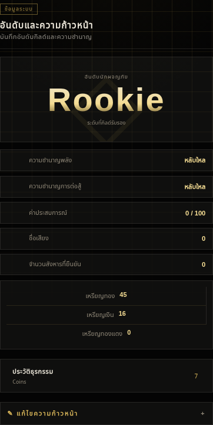
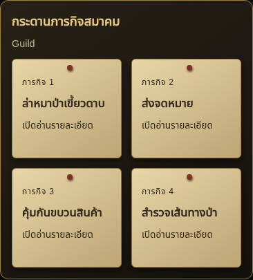
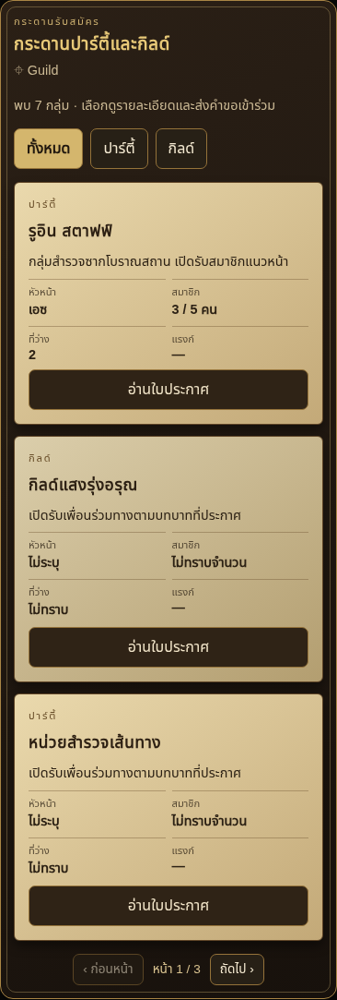

# v0.51.9 — ประมูลที่จบแล้วและกระดานใน Main Chat

แก้สี่จุดที่รายงาน โดยแก้ตั้งแต่การเลือกคำสั่งใน prompt การรับข้อมูล ไปจนถึงตัวแสดงผล

## ข้อความดิบในหน้าอันดับ

`renderRank()` ยังเรียก `renderAuctionWallet()` ซึ่งนำชื่อและสถานะของทุก session ประมูลมาพิมพ์เป็นย่อหน้าดิบ และแสดงคำแนะนำให้ประมูลต่อแม้ session จบแล้ว ชื่อซ้ำจึงแสดงซ้ำตามข้อมูลที่บันทึกไว้ ลบตัวแสดงผลเก่านี้ออก หน้าอันดับยังแสดงยอดเงินและประวัติธุรกรรมเดิม

## โรลรับของหลังจบประมูล

เดิมการเลือกเปิด composer ใช้คำว่า `ประมูล/ซื้อ/สินค้า/ร้าน` เป็นหลัก ข้อความ “หลังจากจบการประมูล … รับตัว … ที่ตัวเองซื้อมา” จึงถูกเลือกเป็นประมูลใหม่ นอกจากนี้ตัวอย่างท้าย prompt ยังเลือกประมูลได้จากชื่อสถานที่หรือข้อความฉากเก่าอย่างเดียว

แก้ให้ตัดการกล่าวถึงรายการที่จบแล้วออกจากการเลือกคำขอใหม่ แยกการรับของที่ชำระแล้วจากการซื้อหรือบิดครั้งใหม่ และนำสถานะรายการที่จบแล้ว ณ สถานที่ปัจจุบันไปประกอบคำสั่งด้วย การสนทนาต่อในโรงประมูลจึงไม่บังคับสร้างประมูลใหม่ หาก AI แนบข้อมูลเปิดรายการเก่ามาระหว่างโรลรับของ ตัวรับข้อมูลจะไม่เปิดรายการนั้น การขอซื้อยาใหม่หรือเข้าร่วมประมูลรอบใหม่อย่างชัดเจนยังทำได้

ทดสอบทั้งช่วงกำลังเจนและหลังคำตอบเสร็จ: ไม่มี composer ใหม่ ไม่มีการเรียก API เพิ่ม ยอดเงินและ inventory คงเดิม ส่วนคำตอบหลักยังดำเนินเรื่องตามปกติ

## กระดานปาร์ตี้/กิลด์และภารกิจ

ก่อนแก้มี instruction สำหรับกระดานอยู่แล้ว แต่ตัวอย่าง JSON ที่เลือกตามข้อความผู้เล่นเน้นเฉพาะ commerce ไม่มีตัวอย่าง `missionBoard/groupBoard` ตามคำขอปัจจุบัน และคำสั่งกระดานบางส่วนเน้นการเดินมาถึง ทำให้การยืนดูหรืออ่านใบประกาศในที่เดิมไม่ได้ถูกย้ำอย่างชัดเจน ตัวตรวจหลักฐานยังรับรูปแบบ “กระดานปาร์ตี้” ได้ แต่ไม่รับคำบรรยายใบประกาศที่ติดบนกระดานไม้บางรูปแบบ

ตอนนี้คำขออ่านกระดานจะได้รับรายการ object ที่ต้องส่งในคำตอบนี้ พร้อมตัวอย่างโครงสร้างครบใน SYSTEM prompt ท้ายประวัติแชต ใช้ schema เดียวกับคำสั่งหลักและตัวรับข้อมูล สอนให้แสดงภารกิจ วัตถุประสงค์ รางวัล และกลุ่มรับสมัครพร้อมเงื่อนไขในคำตอบหลักเดียวกัน การยืนดูอยู่แล้วไม่ต้องเดินเข้าใหม่ ไม่ต้องเลือกงานก่อน และไม่ต้องส่งคำขอดูรายการอีกรอบ

ตัวตรวจยอมรับหลักฐานจากใบประกาศที่อ่านได้จริง รวมคำบรรยายภาษาไทยลักษณะเดียวกับภาพที่รายงาน โดยยังตรวจคำอ้างอิงตรงกับข้อความ สถานที่ปัจจุบัน และความถูกต้องของรายการ แผนในอนาคต/OOC/หลักฐานที่แต่งขึ้นยังไม่ผ่าน การดูรายการไม่รับภารกิจหรือสมัครสมาชิกให้อัตโนมัติ

ภารกิจแสดงได้สูงสุด 4 ใบพร้อมกัน กระดานปาร์ตี้/กิลด์รับได้สูงสุด 12 รายการ แสดงหน้าเริ่มต้นครั้งละ 3 รายการ พร้อมตัวกรองและปุ่มเปลี่ยนหน้า การอ่านรายละเอียดและเปลี่ยนหน้าใช้ข้อมูลเดิม ไม่เรียก AI เพิ่ม

ลบปุ่ม “เตรียมข้อความขอดูรายการ” จากสถานะข้อมูลกระดานไม่ครบ เพราะการ์ดต้องเกิดพร้อมคำตอบหลัก หาก provider ไม่ส่ง payload ตามคำสั่ง ยังแจ้งข้อผิดพลาดตามจริงและใช้ Swipe/Regenerate ได้ ไม่มีการแต่งข้อมูลกระดานที่หายไปหรือเรียกโมเดลเพิ่มเพื่อสร้างกระดาน

## การตรวจสอบและใช้งาน

ผ่าน 677 unit/host tests, syntax checks, Main Chat จาก production loader ที่ 320/390/1280 px, optional switches และ null regressions ตรวจจำนวนคำตอบหลัก/API แยกกัน พร้อมทดสอบกระดานสองชนิดในคำตอบเดียว การเปลี่ยนหน้า เปิดรายละเอียด สถานะภารกิจที่ยังไม่รับ และหน้าอันดับหลังจบประมูล

ภาพเป็น UI ของ extension จริงบนโฮสต์ทดสอบ ใช้ข้อความและคำตอบ provider จำลอง ไม่ใช่แชตหรือ chatbar ของผู้ใช้ การทดสอบยืนยันการส่ง prompt และการรับ/แสดงข้อมูล ไม่รับประกันว่าทุก provider จะส่งข้อมูลตามคำสั่งทุกครั้ง

อัปเดตเป็น v0.51.9 แล้วรีโหลด ให้เปิดกระดานภารกิจและกระดานปาร์ตี้/กิลด์ใน RoleForge Control center ตามระบบที่ต้องการใช้ คำตอบเก่าที่ไม่มีข้อมูลกระดานต้อง Swipe/Regenerate จึงจะใช้คำสั่งใหม่ ไม่ต้องล้างข้อมูล RPG
